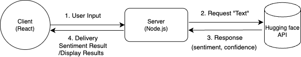

## Code Test (with Huggingface API)

### ■ Project description. <br>

A full-stack application buiilt with React and Node.js for code test.

- Sentiment analysis using the Hugging Face API
- Responsive UI built with React and TailwindCSS
- Backend API using Node.js and Express for processing user input <br>


### ■ Installation and setup steps. 

1. Clone the repository

2. Setup the Server (Node.js)

```
cd server
npm install
```

Create `.env` file in the `server` directory:
```
API_KEY = <your-huggingface-api-key>
```

3. Setup the Client (React)
```
cd client
npm install
```

<br>

### ■ How to run the application.  

1. Start the Server
```
cd server
node api.js
```

2. Strat the client 
```
cd client
npm start
```
The React app will run on `http://localhost:3000`

<br>

### ■ API Endpoint detail. 

#### POST/analyze

- Accepts user input text and returns the sentiment and confidence score.

- Request Body
```
{
    "text" : "I like you"
}
```

- Response 
```
{"sentiment":"POSITIVE","confidence":0.9998695850372314}
```
<br>

### ■ Diagrams: Add an architecture diagram explaining the data flow.


